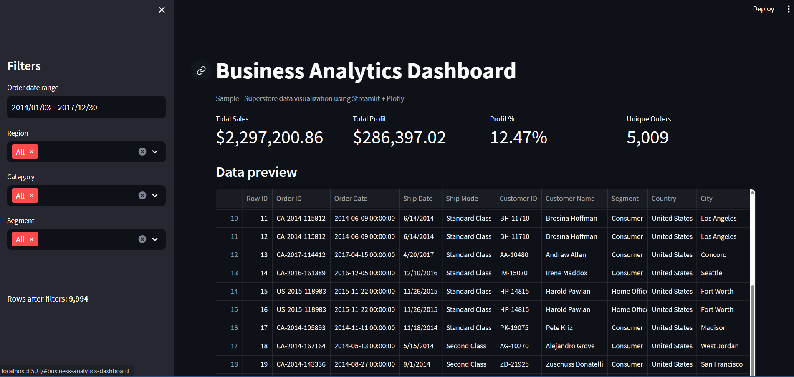

 BUSINESS ANALYTICS DASHBOARD

A modern, interactive analytics dashboard built with Python, Streamlit, and Plotly

     

** Overview **

This project is an interactive Business Analytics Dashboard that provides insights using:

*Sales Analysis
* Profit Breakdown
* Category & Segment Trends
* Region-Level Insights
* Interactive Plotly Visualizations

The dashboard is built for data analysts, business users, and stakeholders to make data-driven decisions with ease.

** Live Demo (Coming Soon)

(Will be added after deployment to Streamlit Cloud)

* Features
 1. Dynamic Filters

1] Date Range Picker

2] Region Filter

3] Category Filter

4] Segment Filter

2. KPI Metrics

1] Total Sales

2] Total Profit

3] Average Discount

  3. Interactive Visualizations

1] Bar Charts

2] Line Charts

3] Scatter Plots

4] Heatmaps

   4. Data Preview

1] Easily inspect raw data with a high-quality table.

** Project Structure
│── dashboard_app.py          # Main Streamlit app
│── Sample-Superstore.csv     # Dataset
│── assets/                   # Screenshots & project media
│── README.md                 # Project documentation

 ** Dashboard Screenshot

Below is a real screenshot of the running dashboard:

  

   * Installation & Running Locally
1️ * Clone the repository
git clone https://github.com/Hiteshmadel21/BUSINESS-ANALYTICS-DASHBOARD.git
cd BUSINESS-ANALYTICS-DASHBOARD

2️  * Install required packages
pip install streamlit plotly pandas

3️  * Run the dashboard
streamlit run dashboard_app.py

** Deployment Instructions (Optional)

You can deploy this dashboard using Streamlit Cloud:

1] Go to https://share.streamlit.io

2] Connect your GitHub

3] Select this repository

4] Choose dashboard_app.py

5] Click Deploy

*** Skills Demonstrated

1] Python Programming

2] Business Analytics

3] Data Cleaning & Processing

4] Interactive Dashboard Development

5] Plotly Visualization

6] Streamlit UI Development

7] Git & GitHub

** Support the Project

If you like this project, please give it a star *** on GitHub.
It helps the repository grow and motivates future improvements.
